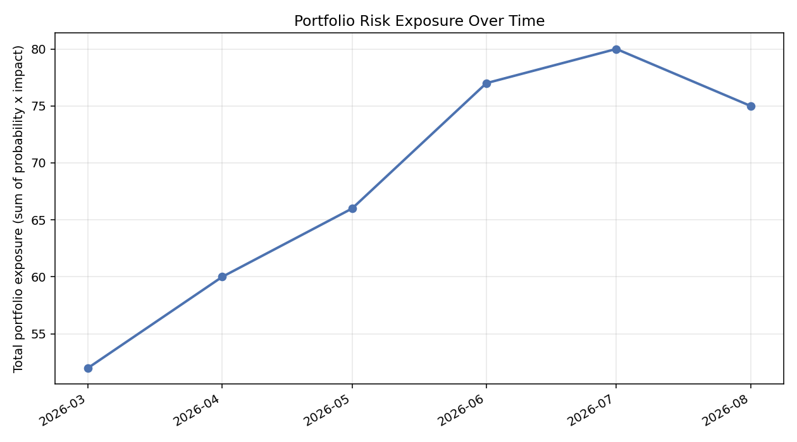
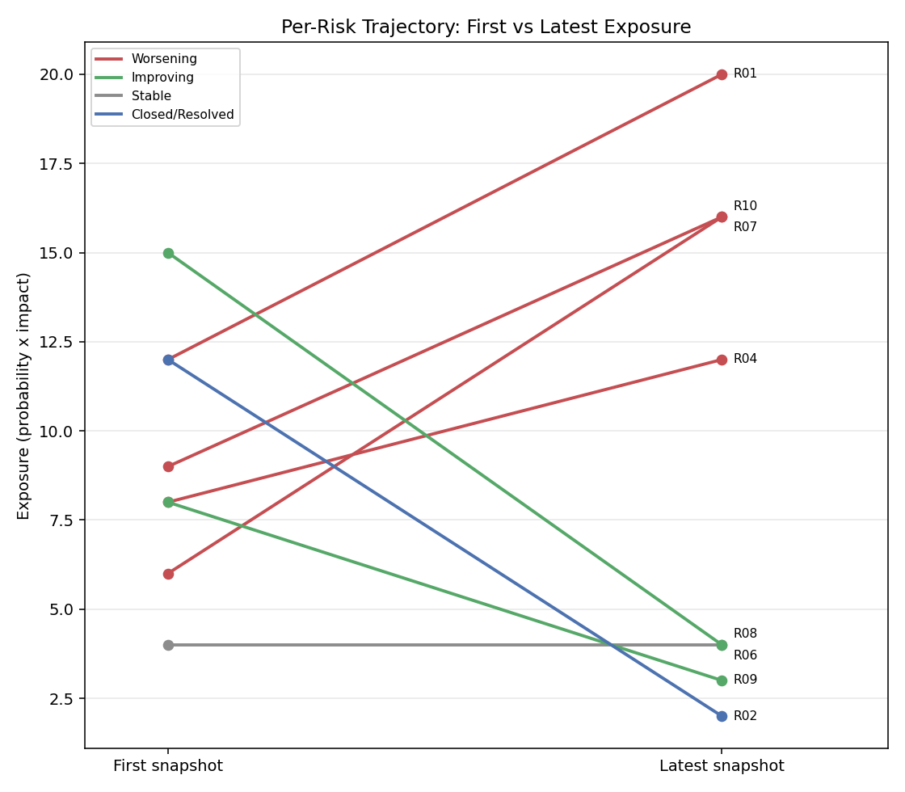
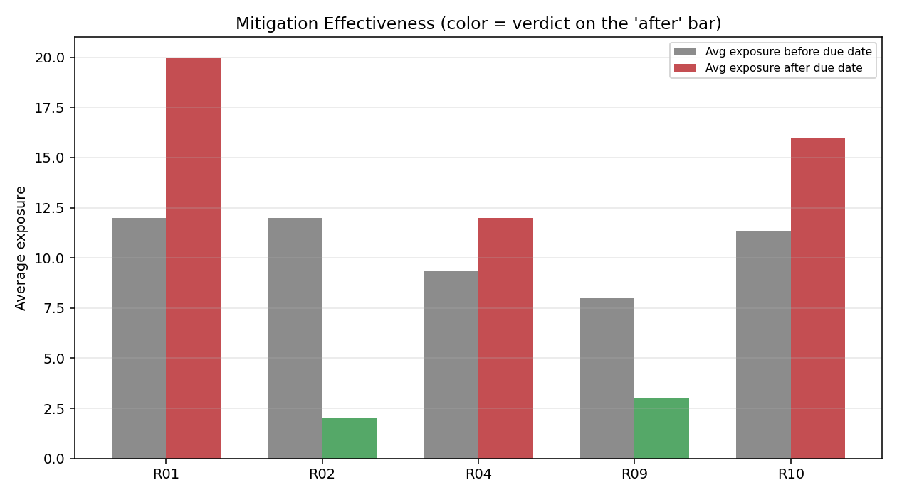

# Risk Trend & Mitigation Tracker

A Python tool that reads a project's risk register as a series of monthly
snapshots, not a single point-in-time list, and answers the question a
snapshot can't: is overall risk exposure rising or falling, which specific
risks are getting worse despite being "in mitigation," and did each
mitigation actually work once its due date passed.

## Problem

A risk matrix at a single point in time tells you how bad things look right
now. It doesn't tell you whether that's an improvement or a slide, and it
can't catch the case that matters most in practice: a risk marked
"Mitigating" whose exposure kept climbing anyway. That only shows up when
you track the same risk across multiple reporting periods and actually
compare before-and-after.

## Approach

- Model the risk register as a panel: one row per (risk, snapshot date),
  so the same risk can appear across several monthly reports with different
  probability/impact/status as it evolves, and drop out once resolved.
- Compute total portfolio exposure at each snapshot date, a trend line, not
  a single number.
- For each risk, compare its first and latest recorded exposure and
  classify it as Worsening, Improving, Stable, or Closed/Resolved.
- For risks with a stated mitigation due date, compare average exposure in
  the snapshots before that date against the snapshots after it, and call
  the mitigation Effective, Ineffective, or Too early to assess if there's
  no snapshot yet past the due date.
- Roll the portfolio trend and mitigation effectiveness into one Risk
  Trajectory Score (unlike the change register tool, exposure trending up
  is unambiguously worse, so a single score is defensible here).

The sample data is eight fictional risks tracked across six monthly
snapshots on an infrastructure project, deliberately mixed: some genuinely
improve, one gets marked "Mitigating" while its exposure keeps rising, and
one is never assigned a mitigation at all and just gets worse.

## Technology

Python, pandas for the panel/groupby logic, matplotlib for the charts.

## Result

```
RISK TREND REPORT
================================================================
Risk Trajectory Score: 20.0 / 100
  - Portfolio exposure trend: 0.0 / 50
  - Mitigation effectiveness: 20.0 / 50

Total exposure, first snapshot: 52
Total exposure, latest snapshot: 75 (+44.2%)
Mitigations assessable: 5  Effective: 2
```

A saved copy of this report, including every risk's full trajectory and
mitigation verdict, is generated alongside the charts: see
[assets/report.md](assets/report.md).

## Screenshots

**Portfolio exposure over time** — total risk exposure by snapshot.



**Per-risk trajectory** — first vs. latest exposure per risk, colored by
trend.



**Mitigation effectiveness** — average exposure before vs. after each
risk's mitigation due date.



## What I learned

The genuinely useful finding here wasn't the headline exposure number, it
was catching R01: a risk marked "Mitigating" for three straight reporting
periods whose exposure went up anyway. A single-snapshot risk matrix would
have shown "Mitigating" and moved on; only comparing snapshots exposes that
the mitigation didn't work. That's the actual case for tracking a risk
register as a time series instead of a recurring point-in-time exercise.

## Limitations

- "Effective vs. ineffective" is a before/after average comparison, not a
  causal claim, a risk could improve or worsen for reasons unrelated to the
  stated mitigation. Useful as a flag to investigate, not a verdict on its
  own.
- No risk correlation or portfolio-level concentration analysis (whether
  several worsening risks share a common root cause).

## Run it

```bash
pip install -r requirements.txt
python risk_tracker.py
```

Swap in your own `data/risk_snapshots.csv` (same columns, one row per risk
per reporting period) to point it at a real risk register.
